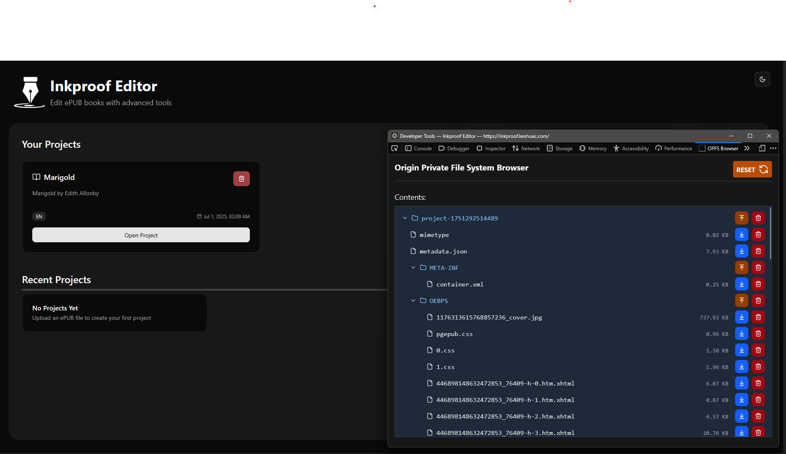

# OPFS-Browser

A Firefox and Chrome extension that can view, and modify the OPFS File System.
[](https://addons.mozilla.org/en-US/firefox/addon/opfs-browser/)



## Usage
When opening the Devtools, there should be a new tab named OFPS Browser.\
Inside the browser, you should be able to see your OPFS folder structure.

Click on a directories to see their contents.
- You can then click on the upload button next to directories to upload files to them
- Or Click on the download button next to files/directories to download them.

### Important Note
This extension is intended for developers\
Adding or Removing files may cause issues with websites.


### Development Instructions
```bash
npm run dev[:chrome|:firefox]
```
will build and refresh the corresponding `dist_<chrome|firefox>` folder.

To create an optimized production build, run `yarn build[:chrome|:firefox]`, or
`npm run build[:chrome|:firefox]`.

#### Load your extension
For Chrome
1. Open - Chrome browser
2. Access - [chrome://extensions](chrome://extensions)
3. Tick - Developer mode
4. Find - Load unpacked extension
5. Select - `dist_chrome` folder in this project (after dev or build)

For Firefox
1. Open - Firefox browser
2. Access - [about:debugging#/runtime/this-firefox](about:debugging#/runtime/this-firefox)
3. Click - Load temporary Add-on
4. Select - any file in `dist_firefox` folder (i.e. `manifest.json`) in this project (after dev or build)

## Credits:
This project is built upon the excellent [vite-web-extension](https://github.com/JohnBra/vite-web-extension) template.